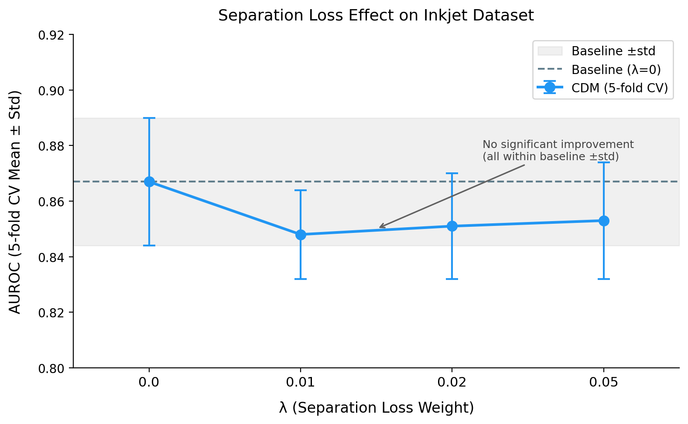

# Conditional Diffusion Models for Out-of-Distribution Detection

> **Master's Thesis** — Johannes Kepler University Linz
> *Conditional Diffusion Models for Out-of-Distribution Detection and Industrial Quality Control*

This repository holds the full LaTeX source, figures, bibliography, and build assets for the thesis, alongside links to every code and data artefact required to reproduce the headline results.

---

## Headline Result

A class-conditional diffusion model used as a generative classifier, with a novel **class-conditional separation loss**, lifts CIFAR-10 OOD detection (airplane vs. rest) from a seed-sensitive baseline to near-saturated, near-zero-variance performance:

<div align="center">

| Setting                          | AUROC                  | Variance reduction |
| -------------------------------- | ---------------------- | ------------------ |
| Binary CDM, *no* separation loss | `92.52% ± 11.07%`      | baseline           |
| Binary CDM, `λ = 0.02`           | **`99.03% ± 0.07%`**   | **~150× tighter**  |

</div>

Same architecture. Same three seeds (42, 123, 456). One loss term. **+6.51 percentage points AUROC** and the standard deviation collapses from 11.07 pp to 0.07 pp.

---

## Reproducible Headline Numbers (seed-42 public checkpoint)

All numbers below are regenerated from the released raw-score tensors in the [`DiffusionOOD`](https://github.com/ahmed-3m/DiffusionOOD) repository (seed 42, `λ = 0.02`, `K = 100`, difference scoring):

<div align="center">

| Dataset                          | Type      | AUROC ↑    | FPR95 ↓ | AUPRC ↑ |
| -------------------------------- | --------- | ---------- | ------- | ------- |
| **CIFAR-10 (airplane vs. rest)** | Within    | **98.98%** | 4.7%    | 99.87%  |
| CIFAR-100                        | Near-OOD  | 96.97%     | 14.8%   | 99.65%  |
| Places365                        | Far-OOD   | 96.50%     | 15.4%   | 99.57%  |
| FashionMNIST                     | Far-OOD   | 94.03%     | 20.5%   | 99.16%  |
| Textures (DTD)                   | Far-OOD   | 92.84%     | 30.1%   | 95.97%  |
| SVHN                             | Far-OOD   | 90.50%     | 27.0%   | 99.38%  |

</div>

External-set mean: **94.17% AUROC** across five datasets, every benchmark evaluated against the full CIFAR-10 test pool.

---

## Against Published One-Class Baselines

On the same CIFAR-10 airplane class (one-vs-rest protocol), the separation-loss CDM clears every published baseline we could find:

<div align="center">

| Method                  | Type             | AUROC      |
| ----------------------- | ---------------- | ---------- |
| OC-SVM (raw pixels)     | One-class        | 63.0%      |
| Deep SVDD               | One-class        | 61.7%      |
| DROCC                   | One-class        | 81.7%      |
| CSI                     | Contrastive      | 89.8%      |
| PANDA                   | Pretrained + OC  | 95.4%      |
| Mean-Shifted C.L.       | Contrastive      | 97.5%      |
| **Binary CDM, λ = 0.02** | **Generative + sep. loss** | **99.03% ± 0.07%** |

</div>

The comparison is asymmetric on purpose (our method trains with an OOD-proxy class while pure one-class baselines see only ID data) — see Section 6.2 of the thesis for the full caveat block.

---

## The Big Idea: Separation Loss

Standard class-conditional diffusion training only asks each conditional branch to denoise its own class well. The separation loss adds a second signal that **pushes the class-conditional noise predictions apart**, which indirectly widens the reconstruction-error gap that the OOD score reads from.

The result is twofold:

1. **Higher absolute performance.** Better ID/OOD separation at the score-distribution level translates to higher AUROC.
2. **Dramatically lower seed sensitivity.** Without the loss, run-to-run variance hides the signal (`±11.07%` across three seeds). With `λ = 0.02`, the model lands within a 0.14-pp band every time.

Figure: `images/fig_cross_domain_comparison.png` — separation-loss sweep on CIFAR-10 vs. inkjet QC, side by side.



---

## Honest Cross-Domain Test: Inkjet Quality Control

The same architecture, the same loss, applied to a real industrial defect-detection task using the public `InkjetOOD` pipeline and the **public FTI_Zer0P dataset**:

<div align="center">

| Setting                            | AUROC                 | Notes                                   |
| ---------------------------------- | --------------------- | --------------------------------------- |
| Inkjet CDM, `λ = 0`                | **`0.8673 ± 0.0230`** | 5-fold image-level stratified CV        |
| Inkjet CDM, `λ ∈ {0.01, 0.02, 0.05}` | not significantly different | separation loss does *not* transfer |

</div>

This is a **deliberate negative result**: the separation loss is not a free lunch. On small, fine-grained industrial datasets where class-conditional noise-prediction gaps do not cleanly translate into reconstruction-error gaps, the trick stops paying. Per-feature analysis (distance features easiest, edge-roughness features hardest) is presented in Section 6.6 of the thesis.

The boundary condition is itself a contribution: future work knows where to look.

---

## Cost Profile (K-Ablation)

Diffusion models pay a serial inference price. We characterise it on an RTX 2080 Ti for 10K CIFAR-10 images:

<div align="center">

| K (timesteps) | Time / 10K images | vs. ResNet-18 wall-clock | AUROC  |
| ------------- | ----------------- | ------------------------ | ------ |
| 50            | 4861.1 s          | 492×                     | 99.0%  |
| **10**        | **972.9 s**       | **68.6×**                | **98.2%** |
| 1             | (not re-timed)    | —                        | 91.0%  |

</div>

`K = 10` is the practical sweet spot: 5× cheaper than `K = 50` and still within 0.8 pp of full performance.

---

## Public Artefacts

Every headline number in this README is regenerable from these:

- **CIFAR-10 OOD code, weights, raw scores** — [DiffusionOOD](https://github.com/ahmed-3m/DiffusionOOD)
- **Inkjet quality-control pipeline** — [InkjetOOD](https://github.com/ahmed-3m/InkjetOOD)
- **Public inkjet dataset** — [FTI_Zer0P on Zenodo](https://doi.org/10.5281/zenodo.11444566)
- **Compiled thesis PDF** — `draft-thesis.pdf` in this repo

The released artefacts include configuration files, git commit hashes, environment metadata, and the exact raw-score tensors used for every reported table.

---

## Repository Layout

```
00-abstract.tex          Abstract
01-introduction.tex      Motivation, contributions, research questions
02-background.tex        OOD detection, generative models, AVI
03-methodology.tex       Binary CDM, separation loss, inkjet multi-head
04-implementation.tex    System design, training, inference cost
05-experimental-setup.tex Datasets, protocol, metrics
06-results.tex           CIFAR-10 + external + inkjet results
07-discussion.tex        Interpretation, limitations, future work
08-conclusion.tex
91-...94-appendix-*.tex  Supplementary material
references.bib           Bibliography (BibLaTeX, ACM-Reference-Format)
images/                  All figures (PNG)
main-thesis.tex          Document root
```

---

## Build the PDF

The thesis compiles with **XeLaTeX** + **Biber** using the included `jkureport.sty`:

```powershell
xelatex main-thesis.tex
biber main-thesis
xelatex main-thesis.tex
xelatex main-thesis.tex
```

The first XeLaTeX pass writes the auxiliary files, Biber resolves the bibliography, and two further XeLaTeX passes settle cross-references, the table of contents, and page numbers.

---

## Citation

If the methods or results here are useful in your work, please cite the thesis. Once a permanent record (Zenodo / institutional repository) is minted, the canonical citation block will appear here.

```bibtex
@mastersthesis{ahmed2026cdmood,
  title  = {Conditional Diffusion Models for Out-of-Distribution Detection
            and Industrial Quality Control},
  author = {Ahmed, [given name]},
  school = {Johannes Kepler University Linz},
  year   = {2026},
  type   = {Master's thesis}
}
```

---

## License

LaTeX source and figures: see `LICENSE` (to be added). Code artefacts in `DiffusionOOD` and `InkjetOOD` carry their own licences; consult those repositories.
